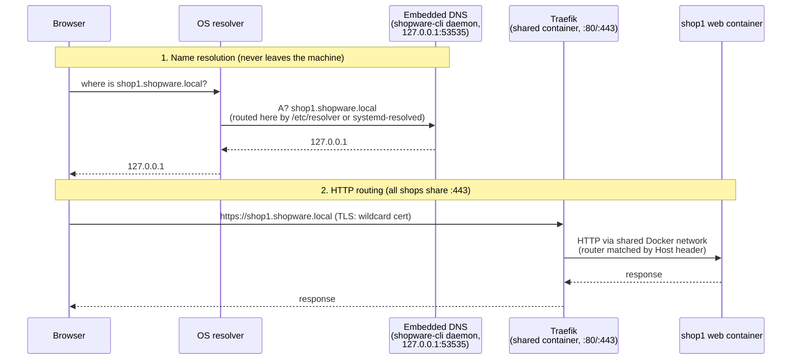
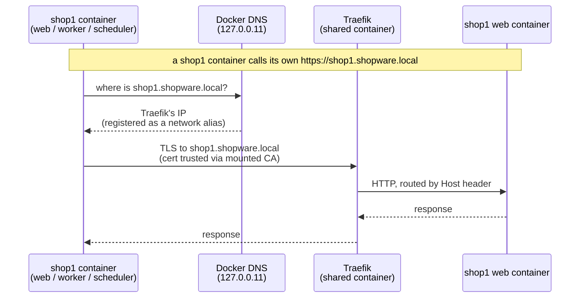

# Local proxy: run many shops at once

`shopware-cli project proxy` lets any number of local Shopware projects run at
the same time, each under a stable hostname like `https://shop1.shopware.local`,
instead of everyone fighting over `127.0.0.1:8000`. This document explains how
it works and why it is built this way. It is accurate to the current
implementation (`internal/proxy/`, `cmd/project/project_proxy*.go`).

## TL;DR

- Every shop gets a hostname derived from its directory name:
  `~/Playground/shop1` → `https://shop1.shopware.local`.
- One shared **Traefik** container routes by hostname, so shop containers
  publish **no host ports at all** — port conflicts disappear by construction.
- A tiny **DNS server embedded in the shopware-cli binary** answers
  `*.shopware.local → 127.0.0.1`. Nothing is installed, no query leaves the
  machine.
- HTTPS works out of the box: a local CA (mkcert-compatible) signs a wildcard
  certificate; `proxy setup` trusts it once per machine.
- Shops can reach **each other** (and themselves) by hostname over HTTPS from
  inside their containers — same names, same certificate, no host involved.
- Everything `proxy up` changes is recorded and **restored exactly** by
  `proxy down`.

| Command | What it does |
| --- | --- |
| `proxy setup` | One-time machine setup: OS DNS routing + CA trust. The single sudo moment. `--domain`, `--skip-trust` |
| `proxy up` | Register the current project: start shared infra if needed, switch the shop to its hostname, start it |
| `proxy down` | Deregister: stop the shop, restore every changed value |
| `proxy list` / `status` | Show registered shops with their URLs / this project's state |
| `proxy verify` | Bottom-up health check of the whole chain, with fix hints |
| `proxy teardown` | `down` for every registered project, then stop shared infra (confirmable, `--force`) |

## The problem

The standard dev environment publishes fixed host ports (`8000`, `9080`,
`8025`, …). Fixed ports mean: second shop → port collision → stop the first
shop or edit ports by hand. Hostnames fix this only if two other problems are
solved: something must *resolve* the hostnames (DNS), and something must
*route* them to the right container (reverse proxy).

## How a request travels

Two deliberately separated responsibilities:

- **DNS is dumb.** The embedded server answers `127.0.0.1` for *anything*
  under the domain (wildcard) — it knows nothing about shops. That is why a
  new shop needs zero DNS changes.
- **Traefik is smart.** It watches the Docker socket and picks up routing
  rules from container labels. Which container answers is decided per request
  by the `Host` header.

### The DNS part in detail

The DNS server is ~180 lines of Go on `golang.org/x/net/dns/dnsmessage`
(`internal/proxy/dns.go`): A queries in the zone → `127.0.0.1`, AAAA → empty
NOERROR (prevents IPv6 fallback delays), anything else → NXDOMAIN. It listens
on UDP `127.0.0.1:53535` — a high port, so it needs no root. `proxy up`
spawns it as a detached background process (re-executing the binary with a
hidden `internal-dns-serve` subcommand) and tracks it via a PID file; after a
reboot the next `up` just respawns it.

The OS is told to use it for exactly one domain (split DNS):

- **macOS**: a file `/etc/resolver/shopware.local` (`nameserver 127.0.0.1`,
  `port 53535`),
- **Linux**: a systemd-resolved drop-in (`DNS=127.0.0.1:53535`,
  `Domains=~shopware.local`).

Writing that config is the one operation that needs sudo, done once by
`proxy setup`. All other DNS traffic is untouched.

> **Hint:** Go's own resolver ignores `/etc/resolver` — that is why
> `proxy verify` checks resolution through `dscacheutil`/`getent` (the real OS
> path browsers use), not through `net.LookupHost`.

## What `proxy up` changes — and how `down` undoes it

A registered shop must not only be *reachable* under its hostname, it must
*believe* in it (Shopware rejects unknown domains with a 400 page). So `up`
touches five things, records the old values, and `down` restores them exactly:

| Change | Where | Restored by `down` |
| --- | --- | --- |
| Traefik labels, no ports, shared network, CA mount | `compose.override.yaml` (generated, marker-guarded) | file deleted |
| `APP_URL=https://<host>` | `.env.local` (one-line surgical edit) | previous value from registry |
| Sales channel domain | database, via `bin/console sales-channel:replace:url` | previous value; for stopped shops via `docker compose run --rm` |
| `url:` keys (top-level + environment) | `.shopware-project.yml` (comment-preserving YAML edit) | previous values; a previously absent key is removed again |
| Traefik network aliases | shared Traefik container | reconciled to the remaining hostnames |
| Registry entry | `<state dir>/registry.json` | entry removed |

Why an **override file** instead of rewriting `compose.yaml`: the base file
stays identical in both modes, so `project dev`, manual `docker compose up`
and the proxy can no longer fight over one file — deleting the override *is*
the mode switch. The override clears the base file's ports with the `!reset`
YAML tag, which requires **Docker Compose ≥ 2.24** (checked by `up`).

Why the core `sales-channel:replace:url` command instead of SQL: it goes
through the DAL, so entity-written events fire and caches invalidate. (The
older `sales-channel:update:domain` is unusable here — it keeps the previous
port.)

> **Trade-off:** while a shop is registered, `.shopware-project.yml` and
> `.env.local` show as modified in git. That is intentional — the dev TUI and
> the admin API client read the URL from those files — but don't commit the
> proxy URLs. `down` cleans them up.

## HTTPS

- The CA is created by code adapted from **mkcert** (`internal/mkcert/`,
  BSD-licensed; mkcert itself is `package main` and cannot be imported). It
  lives in mkcert's standard CAROOT and uses mkcert's format — **anyone who
  ever ran `mkcert -install` is already trusted with zero prompts**, and
  certificates from either tool are interchangeable.
- `proxy up` maintains one server certificate. TLS wildcards match a single
  label, so `*.shopware.local` covers `shop1.shopware.local` but **not**
  `mailer.shop1.shopware.local` — every registered project contributes a
  `*.<project>.shopware.local` SAN and the certificate is regenerated when the
  set changes. Traefik watches the cert files and reloads without restart.
- Trust installation (`proxy setup`) uses the `smallstep/truststore` library
  (the maintained port of mkcert's trust-store code, also used by Caddy):
  system keychain / CA directory, plus best-effort NSS for Firefox.
- **Degraded mode is fine:** with `--skip-trust` (or a blocked trust store)
  everything still works — browsers just show a click-through warning.
  Firefox can import the CA per-user without admin rights.

## Reaching the shop from inside its own containers

Everything above is about the **browser on the host** reaching a shop. But the
shop's containers also call the shop's **own `APP_URL`** — a shop registering
an app and receiving the confirmation callback, the sitemap generator fetching
its own URL, the message queue worker running a flow action that hits the API.
Once `APP_URL` is `https://shop1.shopware.local`, those calls originate *inside*
a container and by default fail twice: the hostname does not resolve there
(containers use Docker's own DNS, not the host's `/etc/resolver`), and even if
it did, the container's trust store does not know the proxy CA.

So the goal here is **self-reachability**: a container calling the shop's own
URL is routed back to the shop over the exact URL and certificate the browser
uses.

- **Resolution** — every registered hostname is added as a **network alias of
  the shared Traefik container** (`ReconcileHostnames`). A shop container
  resolving `shop1.shopware.local` via Docker's embedded resolver gets
  Traefik's address and is routed by `Host` back to the shop, identical to
  host-side traffic. Reconciled on `up`/`down`, only when the set actually
  changed (no needless network flap).
- **Trust** — the proxy CA is mounted read-only into the shop's containers and
  `NODE_EXTRA_CA_CERTS` points at it, so Node code trusts the certificate
  immediately.

The web, worker and scheduler containers all join the shared network and carry
the CA, so a self-call works whether it originates from a request, the queue
worker, or a scheduled task.

> **Nice side effect — cross-shop:** because all registered hostnames are
> aliased on the one shared Traefik, a container in one shop can also reach
> *another* registered shop by its hostname over the same TLS (e.g. one shop
> acting as an app backend for another). This falls out of the design for
> free; it is not the primary goal. A shop that is registered but not running
> resolves to Traefik and gets a 404 (no live route) — the expected "not up"
> signal, not a crash.

> **Current boundary (PHP):** Node trust works today; PHP/curl reads the
> system CA bundle, which only includes the mounted CA once the container runs
> `update-ca-certificates` on it. That step lives in the `docker-dev` image,
> so full PHP trust is a coordinated `docker-dev` change — the CA is already
> mounted at the standard anchor path (`/usr/local/share/ca-certificates/`) so
> it works the moment the image cooperates.

## Design decisions and their trade-offs

| Decision | Why | Trade-off |
| --- | --- | --- |
| Embedded local DNS instead of a public wildcard domain (`*.sslip.io`-style) | Works offline; immune to DNS-rebind protection in routers/corporate resolvers (they drop public answers pointing at `127.0.0.1`); project names never leak to a public DNS service | One-time `setup` with sudo; a corporate VPN agent that hijacks OS DNS can interfere (diagnosed by `verify`) |
| No automatic `/etc/hosts` editing | It would be a second, confusing mechanism; the CLI should not silently edit a system file it does not own | On Linux without systemd-resolved, wildcard DNS is impossible — the CLI explains why, how to enable systemd-resolved, and offers manual hosts lines as last resort |
| Base domain `shopware.local`, changeable via `proxy setup --domain` (persisted machine-wide) | One setting all commands read; per-command flags would let resolver, certs and registry drift apart | `.local` is technically mDNS territory (RFC 6762); macOS conflicts are rare but real — the `verify` hint suggests switching to e.g. `shopware.internal` if resolution misbehaves |
| Traefik state dir mounted at `/shopware-cli`, not `/etc/traefik` | Traefik silently prefers a `traefik.yml` found in `/etc/traefik` over **all** CLI flags — a stray file there once disabled our config invisibly | None; the path is referenced explicitly everywhere |
| `golang.org/x/net/dns/dnsmessage` instead of `miekg/dns` | miekg/dns v1 is in maintenance mode, v2 is unstable until ~2028; `x/net` is Go-team maintained and was already in the dependency graph | ~80 extra lines of hand-written (fully tested) UDP/wire-format code |
| Shared infra is lazy (`up` starts it), not a system service | No launchd/systemd units to install/uninstall; nothing runs when no shop does | After a reboot, the first `proxy up` brings infra back — shops don't auto-start |
| `teardown` deregisters **all** projects first (with confirmation / `--force`) | Stopping only the infra would strand running shops on dead hostnames and leave their URLs broken | Deregistering a *stopped* shop needs a throwaway container for the DB restore (~15 s) |

## State the CLI writes

| Location | Content |
| --- | --- |
| `~/Library/Application Support/shopware-cli/proxy/` (macOS) / `~/.config/shopware-cli/proxy/` (Linux) | `registry.json` (registered projects + remembered previous values), `settings.json` (domain), `dns.pid` / `dns.domain` / `dns.log` (daemon), `traefik/certs/` + `traefik/dynamic/` (server cert, watched Traefik config) |
| mkcert CAROOT (e.g. `~/Library/Application Support/mkcert/`) | `rootCA.pem`, `rootCA-key.pem` — shared with mkcert |
| `/etc/resolver/<domain>` or `/etc/systemd/resolved.conf.d/90-shopware-cli.conf` | OS split-DNS routing (sudo, written by `setup`, removed on domain change) |
| Per project | `compose.override.yaml` (incl. the read-only CA mount), `APP_URL` in `.env.local`, `url:` in `.shopware-project.yml` — all reverted by `down` |

## When something is wrong

Run `shopware-cli project proxy verify`. It checks the chain bottom-up —
Docker → embedded DNS answers → **OS actually routes to it** → Traefik on
:443 → trusted HTTPS against `https://proxy.<domain>/ping` — and stops at the
first broken layer with a plain-language hint (including what to ask an IT
team when sudo is blocked, and likely causes such as VPN DNS interception).
Every failure mode the messages describe is unit-tested.

## Known limitations

- **Windows is not supported** (stubs return a clear error; the CLI itself
  still compiles and works there).
- Requires the Docker-based dev environment and **Docker Compose ≥ 2.24**.
- One `sudo` interaction per machine (`proxy setup`); on corporate machines
  with blocked sudo the CLI prints exact hand-over instructions for IT.
- Auxiliary services keep working through subdomains (`mailer.shop1…`,
  `adminer.shop1…`); the raw ports (`3306`, SMTP `1025`, …) are not published
  in proxy mode — use `docker compose exec` or a temporary override for raw
  TCP access.
- **In-container HTTPS trust is Node-only for now.** PHP/curl calls to a proxy
  hostname need `update-ca-certificates` to run in the `docker-dev` image (see
  "Reaching the shop from inside its own containers"); until then such calls
  must trust the CA explicitly. Only the shop's **root** hostname is aliased
  for in-container use — service subdomains (`mailer.…`) are host/browser-facing.
- **Changing the admin-worker setting while a shop is proxied can orphan the
  worker/scheduler containers.** `down` regenerates `compose.yaml` from the
  current config; if the dedicated worker/scheduler no longer belong there,
  `docker compose down` does not know to stop the already-running ones. It is
  an edge (no normal flow flips that mid-lifecycle); `docker compose down
  --remove-orphans` clears it.
- **Dev watchers (`admin-watch`, `storefront-watch`) are not wired end-to-end.**
  Traefik routes the subdomains and proxies websockets, but Vite's HMR client
  URL and `allowedHosts` must point at the proxy hostname — that config lives
  in `docker-dev` / the Vite setup, so it is a separate, cross-repo workstream.
- **WSL2 is unaddressed.** Native Windows is a clean "not supported"; WSL2
  (daemon in the distro, browser on the Windows side) would need extra
  resolver wiring and is out of scope for now.
